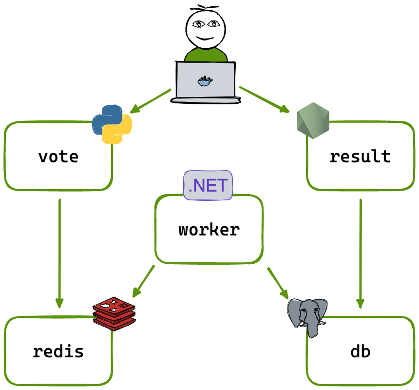

# Example Voting App

A simple distributed application running across multiple Docker containers.

## Getting started

Download [Docker Desktop](https://www.docker.com/products/docker-desktop) for Mac or Windows. [Docker Compose](https://docs.docker.com/compose) will be automatically installed. On Linux, make sure you have the latest version of [Compose](https://docs.docker.com/compose/install/).

This solution uses Python, Node.js, .NET, with Redis for messaging and Postgres for storage.

Run in this directory to build and run the app:

```shell
docker compose up
```

The `vote` app will be running at [http://localhost:8080](http://localhost:8080), and the `results` will be at [http://localhost:8081](http://localhost:8081).

Alternately, if you want to run it on a [Docker Swarm](https://docs.docker.com/engine/swarm/), first make sure you have a swarm. If you don't, run:

```shell
docker swarm init
```

Once you have your swarm, in this directory run:

```shell
docker stack deploy --compose-file docker-stack.yml vote
```

## Run the app in Kubernetes

The folder k8s-specifications contains the YAML specifications of the Voting App's services.

Run the following command to create the deployments and services. Note it will create these resources in your current namespace (`default` if you haven't changed it.)

```shell
kubectl create -f k8s-specifications/
```

The `vote` web app is then available on port 31000 on each host of the cluster, the `result` web app is available on port 31001.

To remove them, run:

```shell
kubectl delete -f k8s-specifications/
```

## Architecture



* A front-end web app in [Python](/vote) which lets you vote between two options
* A [Redis](https://hub.docker.com/_/redis/) which collects new votes
* A [.NET](/worker/) worker which consumes votes and stores them in…
* A [Postgres](https://hub.docker.com/_/postgres/) database backed by a Docker volume
* A [Node.js](/result) web app which shows the results of the voting in real time

## Notes

The voting application only accepts one vote per client browser. It does not register additional votes if a vote has already been submitted from a client.

This isn't an example of a properly architected perfectly designed distributed app... it's just a simple
example of the various types of pieces and languages you might see (queues, persistent data, etc), and how to
deal with them in Docker at a basic level.

##  Docker Setup & Troubleshooting Guide

This section provides additional help for users who are new to Docker and may face issues while setting up or running the Example Voting App.

1. docker compose: command not found

Cause: Docker Compose is not installed or not linked properly.
Fix (for Linux users):

`sudo apt install docker compose`

After installation, verify using:

`docker compose version`

2. Containers fail to start or exit immediately

Cause: A required image or service may have failed to build.
Fix:

`docker compose down`
`docker compose build --no-cache`
`docker compose up`

3. “Port already in use” error

Cause: Another app or previous Docker container is using the same port (8080 or 8081).
Fix:

Stop all running containers:

`docker stop $(docker ps -q)`

Or, change the ports in the docker-compose.yml file before running again.

4. Docker daemon not running

Cause: Docker Engine is not active.
Fix:

On Windows/Mac, open Docker Desktop and wait until it says “Docker is running”.

On Linux, start Docker manually:

`sudo systemctl start docker`


Then try running:
`docker ps`


to verify that Docker is running.

5. Permission denied (Linux)

Cause: Your user account doesn’t have permission to run Docker commands.
Fix:

`sudo usermod -aG docker $USER`

6. Cannot access http://localhost:8080 or http://localhost:8081

Cause: Containers might not be running properly.
Fix:

Check the container status:

`docker ps`


If they aren’t running, restart the app:

`docker compose up`

7. Reset the environment completely

If you want to start fresh (remove all containers, images, and volumes):

`docker compose down --volumes`
`docker system prune -a`


### Verify Installation

Before running the app, make sure both Docker and Docker Compose are installed correctly.

Check by running these commands:
`docker --version`
`docker compose version`

